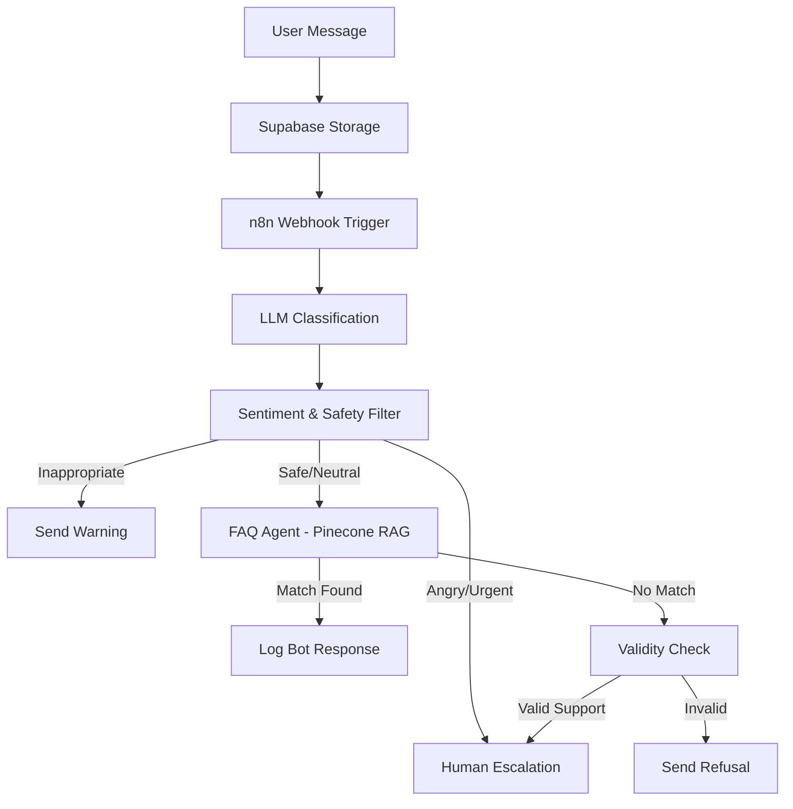

# Agentic Customer Support System 🤖🎧

> **A Next-Generation AI Support Framework with Multi-Agent Orchestration & Real-Time Human Handoff.**

### 🔗 Live Demos
*   **User Dashboard:** [https://capable-crumble-35a09b.netlify.app/](https://capable-crumble-35a09b.netlify.app/)
*   **Company Dashboard:** [https://agentic-customer-support-company-da.vercel.app/](https://agentic-customer-support-company-da.vercel.app/)

---

## 🌟 Project Overview
The **Agentic Customer Support System** is a production-grade support ecosystem powered by a multi-agent AI architecture. Unlike traditional linear chatbots, this system leverages specialized LLM-based agents to autonomously classify, analyze, and resolve customer inquiries with human-like nuance.

It features a **dual-interface system**:
1.  **User Chat Interface**: A sleek, real-time interface for customers to interact with the AI or human agents.
2.  **Company Analytics Dashboard**: A professional control center for monitoring system performance, sentiment trends, and managing escalations.

---

## 🔴 The Problem: "Support Debt"
Modern businesses struggle with rising costs and latency in manual customer service.
-   **Latency:** Manual support takes hours; customers expect seconds.
-   **Rigidity:** Standard chatbots fail on complex, multi-part queries or high-emotion scenarios.
-   **Cost:** Scaling human teams for 24/7 support is prohibitively expensive.

## 💡 The Solution: Agentic AI
We provide an **Agentic AI** layer that acts as the first line of defense. By decomposing the support process into specialized modular tasks, the system ensures that simple queries (FAQs) are handled instantly, while high-stakes or complex issues are prioritized for human escalation.

---

## 🏗️ System Architecture & Data Flow

The system operates on a sophisticated pipeline that balances automation with human intelligence.

### 🔄 Message Processing Pipeline
1.  **Intake**: Message received via Webhook.
2.  **Classification**: Groq-powered LLM categorizes the ticket (billing, technical, etc.) and sets initial urgency.
3.  **Safety & Sentiment**: Parallel analysis for profanity, threats, and user frustration.
4.  **RAG (Retrieval Augmented Generation)**:
    *   **Embeddings**: Google Gemini (`gemini-embedding-001`).
    *   **Vector Search**: Pinecone retrieves relevant knowledge from the FAQ index.
5.  **Resolution/Escalation**:
    *   If a match is found: AI formulates a professional response.
    *   If no match or high urgency: Ticket is escalated to a **Human-in-the-Loop** (HITL) system.

### 📊 Logical Flow

---

## 🛠️ Tech Stack

### Backend & Orchestration
-   **Orchestration**: [n8n](https://n8n.io/) (Low-code workflow automation)
-   **Database**: [Supabase](https://supabase.com/) (PostgreSQL + Realtime WebSockets)
-   **LLMs**: Groq (Llama 3/GPT-OSS), Google Gemini 1.5 Pro
-   **Vector Database**: [Pinecone](https://www.pinecone.io/) (FAQ storage & retrieval)
-   **Embeddings**: Google Gemini Embeddings

### Frontend
-   **User Dashboard**: Vanilla JS, HTML5, CSS3 (Optimized for speed and accessibility).
-   **Company Dashboard**: React 19, Vite, Tailwind CSS, Recharts (Modern analytics UI).

---

## 📁 Project Structure

| Folder / File | Description |
| :--- | :--- |
| `user_chat_dashboard/` | **Customer Interface**: Lightweight Vanilla JS app using Supabase Realtime for instant messaging. |
| `company_analytics_dashboard/` | **Admin Control Center**: React application providing live metrics, sentiment analysis, and ticket management. |
| `n8n_workflow.json` | **The Brain**: The complete multi-agent workflow configuration including classification, RAG, and safety logic. |
| `docs/` | **Documentation**: Detailed architectural breakdowns, sequence diagrams, and image assets. |
| `README.md` | **Main Entry Point**: This detailed guide to the entire system. |

---

## 🚀 Key Features

-   ✅ **Multi-Agent Orchestration**: Separate agents for classification, sentiment, and FAQ resolution.
-   ✅ **Real-Time Communication**: Zero-refresh chat experience powered by Supabase Realtime.
-   ✅ **Safety Guardrails**: Built-in detection for profanity, threats, and off-topic queries.
-   ✅ **Human-in-the-Loop**: Seamless handoff from AI to human agents when sentiment or urgency peaks.
-   ✅ **Advanced Analytics**: Visual insights into response times, sentiment trends, and bot vs. human resolution rates.
-   ✅ **Scalable RAG**: Efficient knowledge retrieval using Pinecone and Gemini embeddings.

---

## 📸 Visual Documentation

### System Workflow

### Sentiment Monitoring

### Architecture Sequence

---

## ⚙️ Setup & Installation

### n8n Workflow
1. Import `n8n_workflow.json` into your n8n instance.
2. Configure environment variables for Supabase, Groq, Pinecone, and Google Gemini.

### Dashboards
1. Navigate to the respective folder (`user_chat_dashboard` or `company_analytics_dashboard`).
2. Update the Supabase configuration in `app.js` or `supabaseClient.js`.
3. For the Company Dashboard, run `npm install` followed by `npm run dev`.

---

## 🖼️ Project Gallery

### 📱 User Experience
| User Chat Interface | Real-time Interactions |
| :---: | :---: |
|  |  |

| Dashboard Overview | Sentiment Analysis |
| :---: | :---: |
|  |  |

---
Built with ❤️ by Palak, Manas, Ekta and Yasir.

