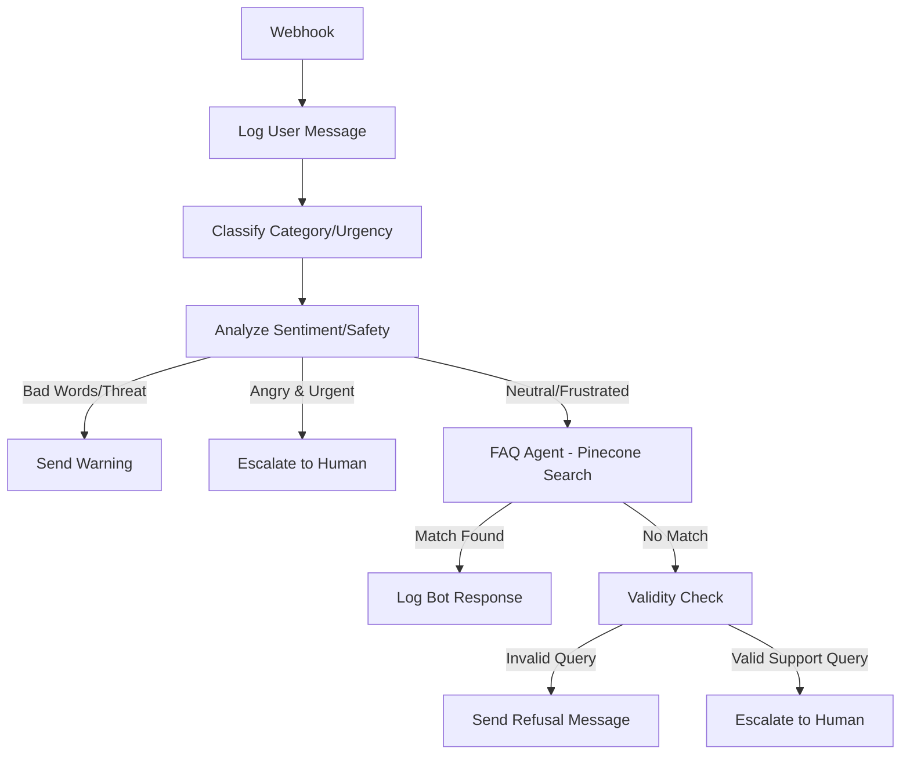

# n8n Workflow Architecture: Agentic Customer Support System

This document provides a detailed breakdown of the production-grade n8n workflow that powers the Agentic Customer Support System. The workflow leverages a multi-stage AI pipeline for classification, safety filtering, and knowledge retrieval.

## Workflow Overview

The system is designed to handle customer queries autonomously while ensuring safety and high-quality responses. It follows a path of:
1. **Intake** -> 2. **Classification** -> 3. **Safety Filtering** -> 4. **Knowledge Retrieval (RAG)** -> 5. **Validation** -> 6. **Resolution/Escalation**.

---

## Technical Stages

### 1. Message Intake & Initial Logging
- **Webhook (POST `/support-query`)**: The entry point for all customer messages.
- **Supabase (Create a row4)**: Immediately logs the raw user message into the `messages` table with `sender: user` for auditability.

### 2. Intelligent Ticket Classification
- **Basic LLM Chain (Groq GPT-OSS-120B)**: Analyzes the user's intent to categorize the ticket into `billing`, `technical`, `account`, `refund`, `shipping`, or `general`. It also assigns an initial urgency level (`high`, `medium`, `low`).
- **JavaScript Parser**: Sanitizes the LLM's JSON output to ensure downstream nodes receive clean data.

### 3. Safety & Sentiment Analysis
- **Sentiment Analyzer (Groq GPT-OSS-120B)**: A specialized AI layer that checks for:
    - **Sentiment**: Detects if the user is `angry`, `frustrated`, or `threatening`.
    - **Safety**: Flags `hasBadWords` (profanity/slurs) or `isThreatening`.
    - **Urgency**: Re-evaluates if the issue is `isHighlyUrgent`.
- **Branching Logic (IF Nodes)**:
    - **Inappropriate Content**: If bad words or threats are detected, the system sends a warning message (`Create a row3`) and stops the pipeline.
    - **High-Priority Escalation**: If the message is `highly urgent`, `high urgency`, and the sentiment is `angry`, it bypasses the bot and escalates directly to a human (`Create a row5`).

### 4. FAQ Knowledge Base Agent (RAG)
For safe and relevant queries, the workflow invokes the **FAQ Responder Agent**:
- **Vector Store (Pinecone)**: Searches the `support-faq-index2` using **Google Gemini Embeddings** (`gemini-embedding-001`).
- **Knowledge Retrieval Tool**: Finds the most relevant FAQ documentation based on the query context.
- **AI Agent (Groq GPT-OSS-120B)**: Formulates a friendly, professional response (under 150 words) using *only* the retrieved knowledge.

### 5. Fallback & Validity Validation
If the FAQ agent cannot find a match (`NO_MATCH`):
- **Validity Check (Groq)**: Performs a final check to see if the query is a legitimate support request.
- **Handling Invalid Queries**: If the query is off-topic (e.g., "what is 2+2"), it sends a polite refusal message (`Create a row`).
- **Handling Unknown Support Queries**: If the query is a valid support request but not in the FAQ, it escalates to a human agent (`Create a row2`) for manual follow-up.

---

## Node Configuration Details

| Node Name | Type | Purpose |
| :--- | :--- | :--- |
| `Webhook` | Webhook | Receives POST requests from the frontend. |
| `Basic LLM Chain1` | Chain LLM | Classifies category and urgency. |
| `Sentiment Analyzer` | Chain LLM | Detects profanity, threats, and emotional tone. |
| `FAQ Responder Agent` | AI Agent | The core RAG engine for answering FAQs. |
| `Pinecone Vector Store` | Vector Store | Stores and retrieves FAQ embeddings. |
| `Validity Check` | Chain LLM | Filters out spam or non-support queries. |
| `Supabase Nodes` | Supabase | Manages all read/write operations for the chat history. |

## Data Persistence (Supabase)

The workflow maintains a stateful conversation by writing to the `messages` table with various sender types:
- `user`: Raw user input.
- `bot`: Automated FAQ or system response.
- `warning`: Safety/Policy violation alerts.
- `pending_human`: Tickets flagged for manual intervention.

---

## Logic Flow Visualization

